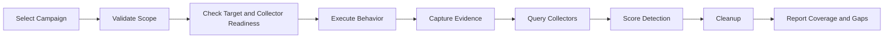

# Antitesa — Adversarial Exposure Validation

**Challenge your defensive assumptions before real adversaries do.**

In critical theory and philosophy, the **antitesa** — or antithesis — is the opposing force that challenges an established thesis.

In cybersecurity, your current thesis is your defensive assumption:

> “Our SIEM rules work.”
> “Our EDR will catch this.”
> “Our SOC has visibility.”
> “Our ransomware detection is ready.”
> “Our ATT&CK coverage is strong.”

**Antitesa exists to challenge those assumptions with evidence.**

Antitesa is an adversarial exposure validation platform that safely emulates attacker behavior, maps it to MITRE ATT&CK, runs it against approved targets, checks whether your defensive stack detects it, and produces evidence-backed results.

---

## Why Antitesa

Security teams already have tools, rules, dashboards, and threat intelligence. But the real question is:

**Can your defenses detect the behaviors they claim to cover?**

Antitesa helps teams prove:

* Did the adversary behavior execute?
* Did the environment generate telemetry?
* Did the SIEM, EDR, or collector detect it?
* Was the result a strong alert or only weak evidence?
* Was the activity missed, blocked, failed, or invisible?
* What detection gap should be fixed next?

---

## Business Impact

Antitesa turns detection validation into a repeatable security program.

It helps organizations:

* Prove control effectiveness with evidence.
* Measure MITRE ATT&CK coverage.
* Prioritize detection engineering work.
* Reduce false confidence in untested rules.
* Validate ransomware readiness safely.
* Turn threat intelligence into real validation campaigns.
* Support SOC, Purple Team, audit, and leadership reporting.
* Continuously test defenses as environments and rules change.

---

## Core Capabilities

### MITRE-Mapped Validation

Every behavior, campaign, result, and coverage view is mapped to MITRE ATT&CK so teams can measure defensive readiness using a common language.

### Evidence-Based Results

Antitesa captures execution proof, telemetry proof, collector findings, detection status, cleanup proof, and result confidence.

### Detection-in-the-Loop

Antitesa does not only run behavior. It immediately asks your defensive stack:

> **Did you detect this?**

### Detection as Code

Use Antitesa to test detection rules like software:

```text
Rule changed
→ Run behavior
→ Confirm telemetry
→ Confirm alert
→ Record evidence
→ Improve and re-test
```

### Collector Framework

Collectors connect Antitesa to SIEM, EDR, log analytics, OT monitoring, and custom telemetry sources.

### Threat-Intelligence-Driven Campaigns

Transform threat intelligence into executable validation campaigns based on adversary behaviors, IoCs, and relevant techniques.

### Full Attack Sequence Behavior

Chain behaviors across discovery, execution, credential-access simulation, persistence simulation, lateral-movement simulation, collection, exfiltration simulation, and impact simulation.

### APT Emulation

Model adversary behavior across multiple phases to validate whether your environment detects realistic attack sequences, not just isolated commands.

### Safe Ransomware Emulation

Validate ransomware-related detections using controlled, reversible, sandboxed behavior such as canary-file modification, impact simulation, recovery checks, and cleanup proof.

---

## Result Model

Antitesa avoids misleading pass/fail reporting.

| Result               | Meaning                                                           |
| -------------------- | ----------------------------------------------------------------- |
| `detected`           | A strong detection fired.                                         |
| `partially_detected` | Telemetry appeared, but no strong alert fired.                    |
| `not_detected`       | Behavior executed and telemetry existed, but detection failed.    |
| `telemetry_missing`  | Detection cannot be judged because required telemetry was absent. |
| `collector_error`    | The detection source could not be queried reliably.               |
| `execution_failed`   | The behavior did not execute successfully.                        |
| `blocked`            | A security control prevented the behavior.                        |
| `cleanup_failed`     | Cleanup did not complete successfully.                            |

This distinction matters because a missed alert, a broken collector, and missing telemetry are different problems.

---

## How It Works



---

## Use Cases

* Continuous detection validation
* Purple Team operations
* Detection engineering QA
* MITRE ATT&CK coverage measurement
* Threat-intelligence-driven validation
* APT emulation
* Safe ransomware readiness testing
* OT/ICS detection validation
* Security control regression testing
* SOC and leadership reporting

---

## What Makes Antitesa Different

**Evidence over assumptions**
Antitesa proves what happened and why the result is valid.

**Detection in the loop**
Execution and detection validation happen in one workflow.

**Threat-informed**
Campaigns are driven by real adversary behavior and intelligence.

**Built for full sequences**
Antitesa validates attack chains, not only single actions.

**Safe by design**
Risky behavior is scoped, controlled, audited, and reversible where possible.

**IT and OT aware**
Antitesa supports enterprise and industrial security validation scenarios.

---

## Safety Position

Antitesa is intended for authorized security validation only.

It is not designed to be:

* An unrestricted exploit framework
* An autonomous offensive platform
* A destructive ransomware tool
* A credential theft tool
* A default OT write-operation tool
* A replacement for human approval and rules of engagement

Every campaign should be scoped, approved, logged, and reviewed.

---

## Vision

Antitesa helps security teams continuously challenge their defensive assumptions with safe adversary emulation, detection-in-the-loop execution, and evidence-backed coverage.

**Your defense is the thesis. Antitesa is the challenge.**

---

## Disclaimer

Use Antitesa only in environments where you have explicit authorization. Operators are responsible for scope, rules of engagement, safety, approvals, and legal compliance.

---

## License

Add your project license here.

---

## Maintainers

Add maintainer and contribution information here.
